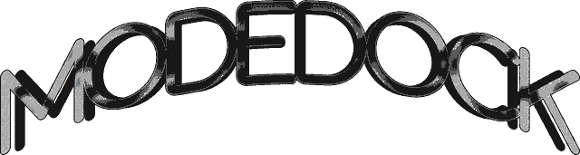

<p align="center">
  
</p>

<h1 align="center">ModeDOCK</h1>

<p align="center">
  Lightweight modular CLI for managing mods, DLLs, and plugins for games and applications.
</p>

<p align="center">
  Fast • Modular • Lightweight • CLI-first
</p>

---

> [!IMPORTANT]
> ModeDOCK is a lightweight command-line tool for managing mods, DLL files, and plugins for supported games and desktop applications.

> [!WARNING]
> Always verify mod/plugin sources before installing them.
> Third-party files may be broken, incompatible, or unsafe.

> [!CAUTION]
> Installing mods may modify application or game files.
> Create backups before making changes.

## 📦 Installation

```bash
npm install -g moddock
